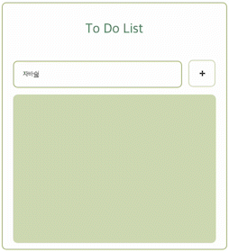
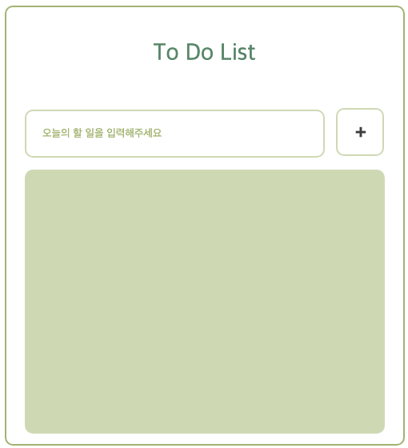
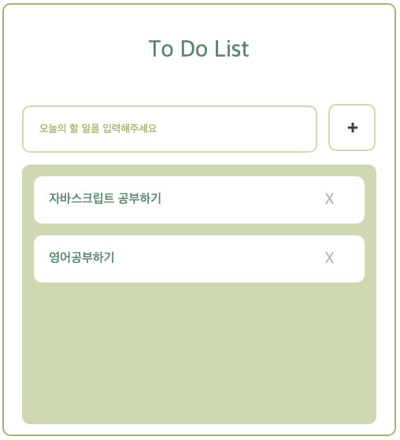
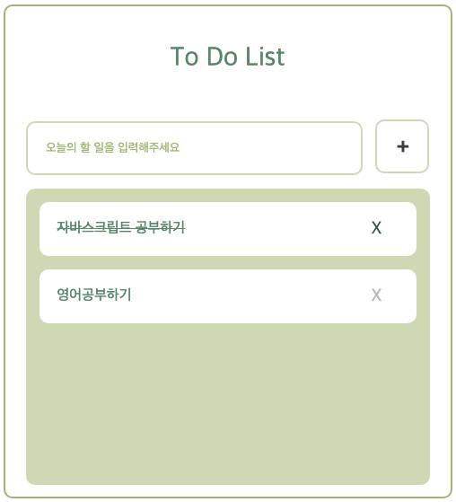
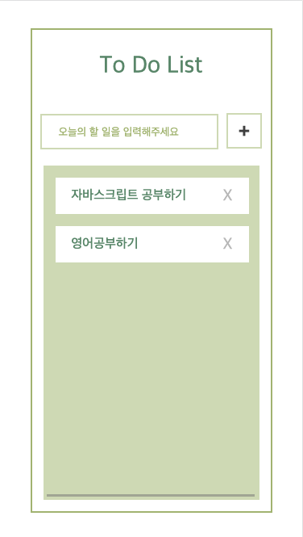

# To do list

 

### ✅ The challenge 

- 할 일 추가, 완료, 삭제, 저장, 예외 처리

 

### ✅ Screenshot 

image

 

## My process

###  ✅ Built with
- HTML & CSS
- JavaScript

 

###  ✅ What I learned
- 로컬 스토리지에 저장하는 방법
- 목록 추가, 삭제, 유효성 검사 등

 

###  ✅ Continued development
- 키보드, 클릭 이벤트를 동시에 적용했을 때 출력값이 두 개가 생기는 오류 -> 조건문을 사용해서 해결
- 로컬 스토리지에 저장한 데이터를 불러오는 부분 공부가 필요하다.
- 마감 기한 설정, 검색 기능, 드래그 앤 드롭, 필터링 기능 등 추가적인 기능 구현을 할 필요가 있다.

 

###  ✅ Useful resources
- [mdn](https://www.example.com ) - This resource helped me with JavaScript methods.

 

## Author

- github - [Daeun Kang](https://github.com/winterkang)

