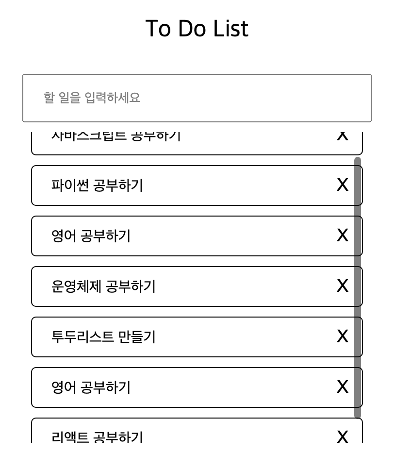

# To do list

 

### ✅ The challenge 

- 할 일 추가, 완료, 삭제, 저장, 불러오기

 

### ✅ Screenshot 

details

 

## My process

###  ✅ Built with
- HTML & CSS
- JavaScript

 

###  ✅ What I learned
- 로컬 스토리지에 저장과 불러오기 및 삭제

 

###  ✅ Continued development
- 드래그 앤 드롭

 

###  ✅ Useful resources
- [mdn](https://www.example.com ) - This resource helped me with JavaScript methods.

 

## Author

- github - [Daeun Kang](https://github.com/winterkang)

