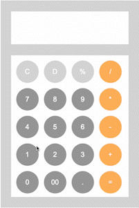
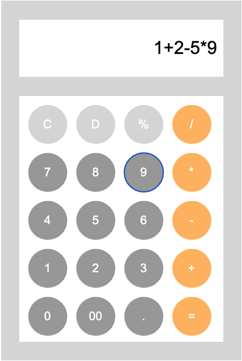
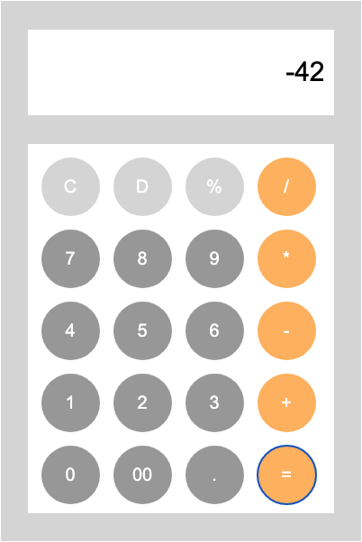

# Calculator

 

### ✅ The challenge 

- 숫자 입력, 연산자 입력, 계산 수행, 결과 출력, 초기화, 예외 처리(숫자 입력 x)

 

### ✅ Screenshot 

image

 

## My process

###  ✅ Built with
- HTML & CSS
- JavaScript

 

###  ✅ What I learned
- 변수에 할당된 표현식을 eval메서드를 사용하여 연산을 수행
- 숫자 입력, 연산자 입력, 계산 수행, 결과 출력, 초기화, 삭제, 예외 처리

 

###  ✅ Continued development
- eval 메서드를 사용하지 않고 직접 계산 로직을 구현해보기

 

###  ✅ Useful resources
- [mdn](https://www.example.com ) - This resource helped me with JavaScript methods.

 

## Author

- github - [Daeun Kang](https://github.com/winterkang)

